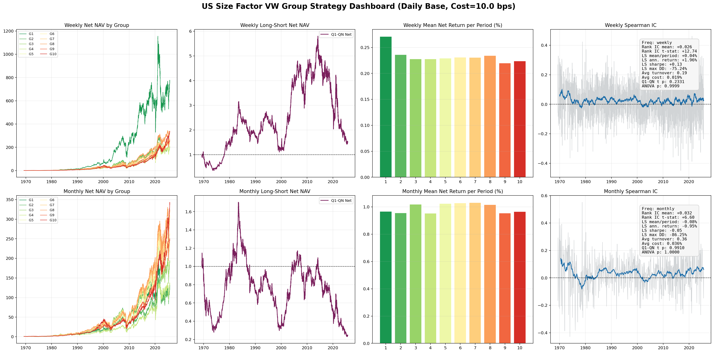

# US Stock Size Factor Research

CRSP-based research scripts for testing the US equity size factor on monthly and daily data, with a stricter "closer to production" weekly/monthly portfolio backtest built on daily data.

This repo currently focuses on one factor:

- `size` / market capitalization

and provides three main workflows:

1. Monthly cross-sectional size test
2. Daily cross-sectional size test with fixed holding days
3. Weekly and monthly calendar-rebalanced, value-weighted grouped strategy with stricter universe screens and transaction costs

## Primary Result

The main result in this repo is the strict weekly/monthly value-weighted strategy built from daily CRSP data, using:

- 10 size groups
- weekly and monthly calendar rebalancing
- stricter US common-stock universe screens
- `180`-day minimum listing age
- `90`-day fundamentals lag
- `10 bps` one-way transaction cost

| Frequency | Rank IC Mean | Rank IC t-stat | Q1-Q10 Net Mean | Annualized Net | Sharpe | t-test p |
| --- | ---: | ---: | ---: | ---: | ---: | ---: |
| Weekly | 0.0257 | 12.74 | 0.0374% | 1.96% | 0.13 | 0.2331 |
| Monthly | 0.0321 | 6.60 | -0.0798% | -0.95% | -0.05 | 0.9910 |




Interpretation:

- the cross-section still shows a measurable size-related signal in IC terms
- but after stricter screening, value weighting, and trading costs, the small-minus-big long-short spread is weak and not statistically significant

## What Is Included

The main code lives in `Factor Test Code/`.

```text
US stock research/
|- README.md
|- crsp_data_ascii/                     # optional local ASCII junction for Windows
|- CRSP数据/                            # local data folder, not intended for GitHub
\- Factor Test Code/
   |- README.md
   |- us_size_factor_test.py
   |- us_size_factor_test_daily.py
   |- us_size_factor_calendar_vw.py
   |- output_calendar_rebalance_strict/
   \- ...
```

## Scripts

### `us_size_factor_test.py`

Monthly size factor test on CRSP monthly stock data.

- cross-sectional grouping
- equal-weight and value-weight returns
- IC / Rank IC
- summary stats and plots

### `us_size_factor_test_daily.py`

Daily size factor test on CRSP daily stock data.

- rebalance every `N` trading days
- forward `N`-day holding return
- equal-weight and value-weight grouping
- IC / Rank IC

### `us_size_factor_calendar_vw.py`

The most realistic workflow in this repo.

It uses daily data as the base dataset and runs:

- `weekly` calendar rebalancing
- `monthly` calendar rebalancing
- value-weighted grouped portfolios
- transaction-cost-adjusted net returns
- combined dashboard output

## Universe Screen For The Strict Strategy

The strict strategy in `us_size_factor_calendar_vw.py` applies a more standard US equity research screen:

- common shares only
- NYSE / AMEX / NASDAQ only
- drop ADRs
- drop REITs
- drop ETFs
- drop closed-end funds
- drop financial firms: `SIC 6000-6999`
- drop firms with non-positive book equity
- drop newly listed firms using a minimum listing age filter
- apply rolling liquidity filters before portfolio formation

Book equity is built from the CRSP-Compustat quarterly merged fundamentals file with a reporting lag, so the screen is not using future information.

## Universe Definition

For the primary result, the investable universe is defined as follows:

- CRSP common shares only
- listed on NYSE, AMEX, or NASDAQ
- exclude ADRs
- exclude REITs
- exclude ETFs and closed-end funds
- exclude financial firms with `SIC 6000-6999`
- exclude firms with non-positive book equity
- exclude recently listed firms using a `180`-day seasoning rule
- require minimum liquidity using price, rolling turnover, and rolling dollar volume filters

In implementation terms:

- `book equity` comes from the CRSP-Compustat merged quarterly fundamentals file
- fundamentals are lagged by `90` days before becoming eligible in the backtest
- the strategy uses daily CRSP data as the return base
- portfolios are value-weighted within each size group
- reported net returns deduct transaction costs based on realized portfolio turnover

## Data Requirements

Expected local data files:

```text
CRSP数据/
|- us_month_stock.zip
|- us_daily_stock.zip
|- delisting.zip
\- CRSP Compustat Merged Database - Fundamentals Quarterly.zip
```

The strict strategy requires the quarterly CRSP-Compustat merged fundamentals file.

## Environment

Python 3.10+ is recommended.

Install dependencies:

```bash
pip install pandas numpy scipy matplotlib
```

## Quick Start

From inside `Factor Test Code/`:

### Monthly test

```powershell
python .\us_size_factor_test.py `
  --data-dir "..\CRSP数据" `
  --output-dir ".\output_monthly"
```

### Daily fixed-hold test

```powershell
python .\us_size_factor_test_daily.py `
  --data-dir "..\CRSP数据" `
  --output-dir ".\output_daily"
```

### Strict weekly/monthly strategy

```powershell
python .\us_size_factor_calendar_vw.py `
  --data-dir "..\crsp_data_ascii" `
  --output-dir ".\output_calendar_rebalance_strict" `
  --n-groups 10 `
  --cost-bps 10 `
  --min-listing-days 180 `
  --fundamental-lag-days 90
```

If you do not use the local ASCII alias, replace `..\crsp_data_ascii` with your actual data directory.

## Main Outputs

The strict strategy writes:

- `size_calendar_rebalance_interval_returns.csv`
- `size_calendar_rebalance_daily_returns.csv`
- `size_calendar_rebalance_ic.csv`
- `size_calendar_rebalance_group_stats.csv`
- `size_calendar_rebalance_tests.csv`
- `size_calendar_rebalance_holdings.csv`
- `size_calendar_rebalance_dashboard_vw.png`

## Notes

- The strict holdings file can be very large.
- The repo is currently focused on research/backtesting, not production execution.
- The long-short summary does not include separate stock borrow cost modeling.
- On Windows, using an ASCII directory alias for the data folder can make large-file workflows more stable.

## Next Extensions

Natural next steps for this repo:

- add more factors
- add benchmark-relative evaluation
- add sector-neutral grouping
- add turnover-constrained portfolio construction
- add explicit short borrow cost assumptions
